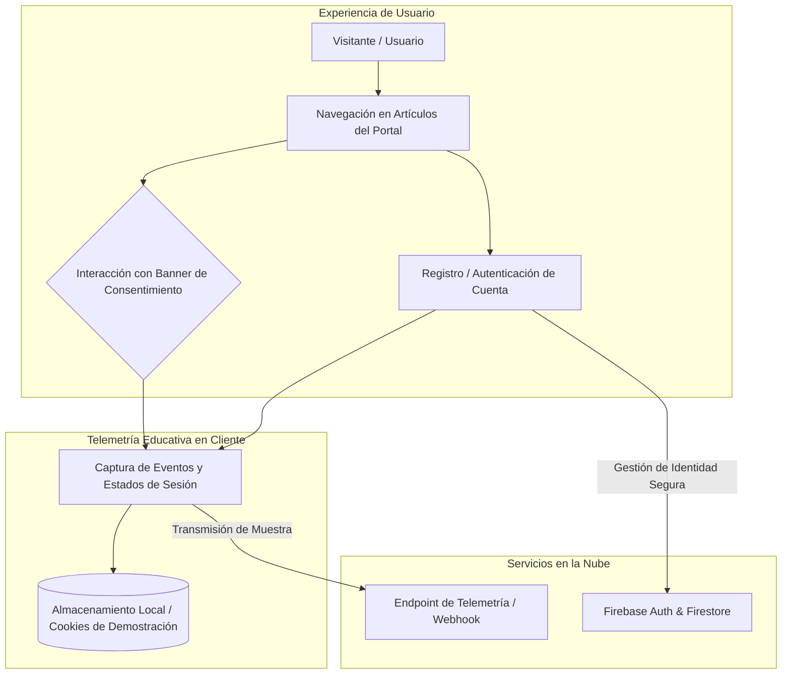

# Global Insight - Portal de Noticias (Demostración de Seguridad)

Proyecto interactivo de prueba de concepto (PoC) y demostración desarrollado con fines educativos y de concientización en ciberseguridad. Simula un portal de noticias internacional (*Global Insight*) para ilustrar de forma práctica la interacción del usuario con políticas de consentimiento, almacenamiento en cliente y recolección de eventos de navegación.

---

> **Aviso Ético y Académico:** Este proyecto ha sido diseñado estrictamente para entornos académicos, talleres de formación técnica y demostraciones educativas sobre seguridad de aplicaciones web y privacidad del usuario.

---

### Flujo de Navegación y Demostración de Telemetría



---

### Características Principales

| Módulo | Enfoque Pedagógico |
| :--- | :--- |
| **Diseño Editorial Responsivo** | Maquetación web moderna con soporte multiplataforma que replica la estructura visual de un medio periodístico real. |
| **Flujos de Autenticación** | Demostración de flujos de registro e inicio de sesión integrados con Firebase SDK. |
| **Gestión de Consentimiento** | Simulación de banners de políticas de privacidad y persistencia de preferencias de usuario en almacenamiento local. |
| **Telemetría y Registro de Eventos** | Envío asíncrono de eventos de navegación a puntos de control para ilustrar la exposición de datos del navegador. |

---

### Stack Tecnológico

- **Frontend:** HTML5 Semántico, CSS3 modular (diseño responsive), JavaScript Vanilla.
- **Servicios Cloud:** Firebase Authentication, Cloud Firestore.
- **Iconografía y Tipografía:** Google Fonts, FontAwesome.
- **Alojamiento y Despliegue:** Vercel.

---

### Instalación y Ejecución Local

1. Clonar el repositorio:
   ```bash
   git clone https://github.com/saolos12/portal-noticias-seguridad-demo.git
   cd portal-noticias-seguridad-demo
   ```

2. Abrir el archivo `index.html` en cualquier navegador web o mediante un servidor de desarrollo:
   ```bash
   # Con Python
   python -m http.server 8000
   ```

3. Demostración en vivo disponible en: [https://portal-noticias-seguridad-demo-lz01lrr1i-saolos12s-projects.vercel.app/](https://portal-noticias-seguridad-demo-lz01lrr1i-saolos12s-projects.vercel.app/)

---

### Licencia

Este proyecto está bajo la licencia MIT.